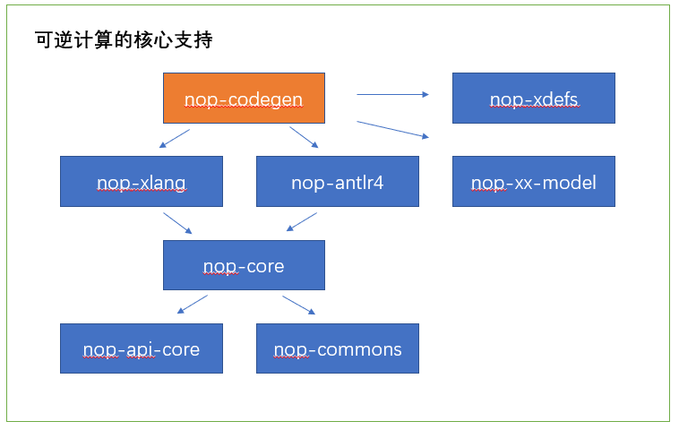
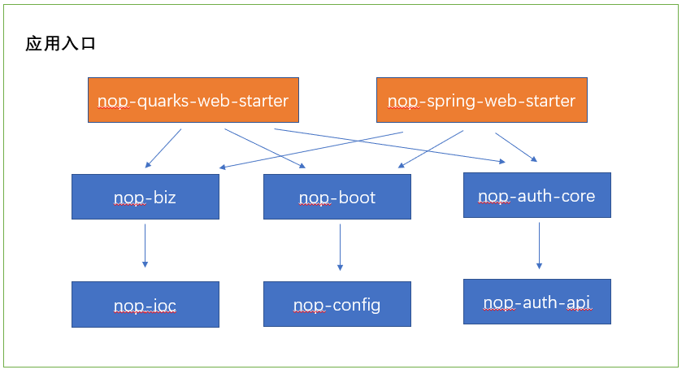
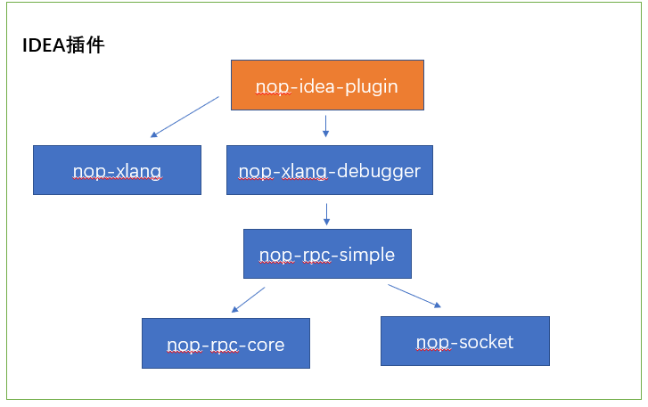

Nop平台的模块虽然很多，但是因为整体设计采用了依赖注入、动态加载等方式，各个模块的耦合度很低，大部分模块都可以独立使用，并且可以脱离Nop平台与其他框架集成使用。

# 一. 核心模块

Nop平台最核心的模块是nop-core、nop-xlang和nop-codegen这模块。**所谓的可逆计算原理的具体实现都集中在这两个模块中**。

* **nop-api-core包含了整个平台对内、对外都需要共享的全局对象和交互消息**。例如平台中使用的所有注解、API调用用到的公共Bean（如ApiRequest, ApiResponse, PageBean），NopException统一异常处理类，IContext全局上下文，IUserContext用户上下文等。当第三方框架需要调用Nop平台提供的服务接口时一般会引用这个模块。

* nop-commons提供了StringHelper, FileHelper等帮助函数，并提供了大量的与业务无关的数据结构封装，例如ThreadPoolExecutor, LocalCache，TextScanner等。

* **nop-core负责提供其他模块都可能会用到的核心模型对象以及全局的模型缓存和依赖跟踪机制**。例如基本的Tree、Table、Graph、Filter、FieldSelection结构定义和相关算法实现，XML和JSON文件解析（没有使用第三方解析库），差量化的虚拟文件系统，全局模型加载器，以及字典表、国际化消息、异常码映射等。为了便于支持GraalVM，core模块还提供了自制的泛型类型定义以及反射调用机制（直接使用Java反射性能较低）。

* **nop-xlang提供Nop平台最核心的XLang语言以及差量合并算法的实现**。XLang语言是一个统称，它包括了Nop平台内置的一系列自定义领域语言，例如XDef元模型定义语言，XMeta对象结构定义语言，Xpl面向元编程的模板语言, XScript支持宏函数的脚本语言, XPath路径查找语言，XTransform结构转换语言等。参见[xlang](https://gitee.com/canonical-entropy/nop-entropy/blob/master/docs/dev-guide/xlang/index.md)

* **nop-codegen提供了可以与maven打包工具集成在一起的代码生成器**。XLang内置的元编程机制可以看作是一种语言内置的代码生成器，而codegen则提供了外置的、数据驱动的差量化代码生成器，参见[codegen.md](https://gitee.com/canonical-entropy/nop-entropy/blob/master/docs/dev-guide/codegen.md)。nop-codegen模块的templates目录下包含了大量内置的代码生成模板，比如/templates/orm用于根据数据模型来生成全套的前后端增删改查代码。这些代码生成模板可能需要解析DSL模型，这时就需要引入对应的元模型和Excel解析模型。比如为了根据g4文件定义生成Antlr AST解析器就需要引入nop-antlr4依赖，参见[antlr.md](https://gitee.com/canonical-entropy/nop-entropy/blob/master/docs/dev-guide/xlang/antlr.md)。为了解析Excel数据模型，我们需要引入nop-orm-model依赖，并使用nop-xdefs模块中的orm.xdef元模型定义。

nop-xlang的开发是一个有趣的自举过程。因为codegen需要使用XLang中的Xpl和XScript语言，而XScript语言的解析器又是根据antlr语法定义模型自动生成的，所以实际开发过程采用了如下方式：

1.  先手工编写一个简易的XScript解析器，使得它可以支持antlr代码生成模板的运行

2. 编写代码生成模板，根据antlr模型生成XScript解析器

3. 用自动生成的解析器覆盖手工编写的XScript解析器

nop-codegen工具可以独立于Nop平台被使用，生成其他框架或者其他语言的代码，比如生成mybatis代码，vue代码等，而且可以将CodeGenerator与FileWatcher结合在一起，**当发现某个目录下的模型文件发生变动时，就自动将依赖于该模型的所有文件重新生成一遍**。

## 二. GraphQL引擎

NopGraphQL引擎没有使用graphql-java包，是完全从零开始实现的一个新的GraphQL引擎。相比于graphql-java，它充分利用了可逆计算理论的差量合并机制，的实现大为简化，性能提供了模型动态加载的能力，并且同时支持REST调用接口与GraphQL调用接口。同时，NopGraphQL的实现也大幅简化，

# 三. 分布式RPC框架

# 四. 应用入口

# 五. 应用模块

# 六. 报表引擎

# 七. 自动化测试框架

# 八. IDEA插件

