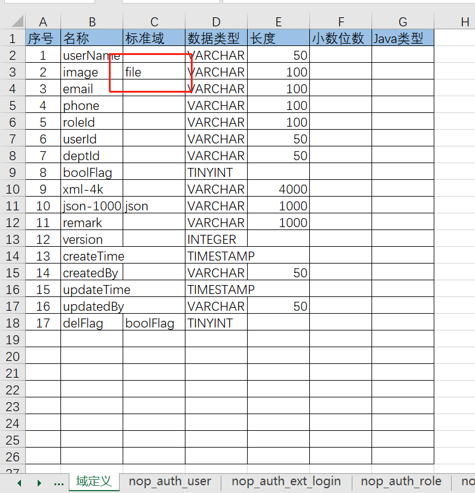
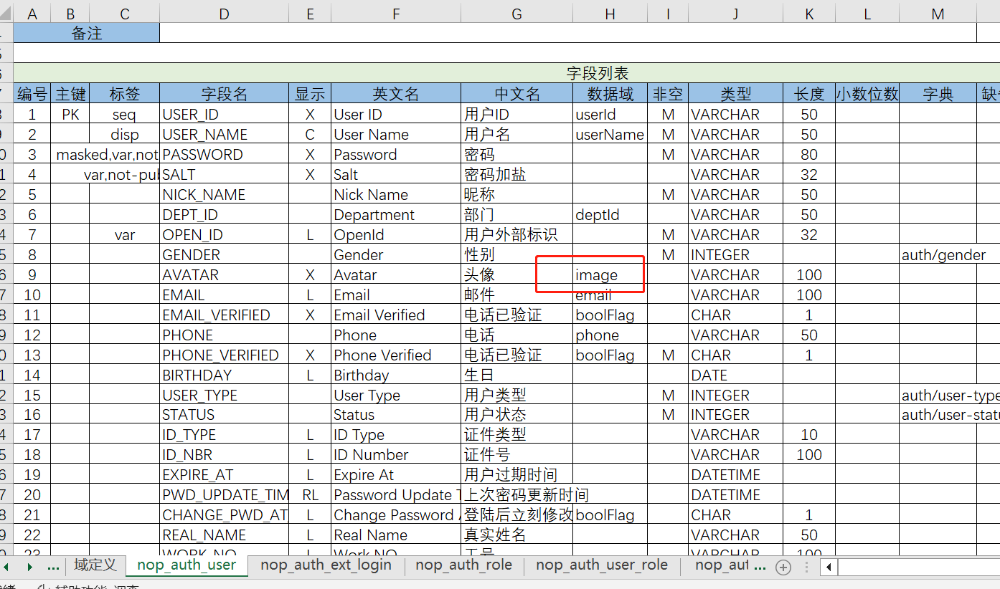

# 文件上传下载

引入nop-quarkus-web-starter或者nop-quarkus-spring-starter依赖后，会自动引入

* nop-file-dao： 包含文件上传下载服务实现
* nop-integration-sso: 包含AmazonS3对象存储支持，阿里云OSS，腾讯云COS，七牛云，京东云，minio都支持这一接口标准。

## Excel数据模型

在Excel数据模型中为字段的domain指定stdDomain=file，表示它保存上传文件的链接地址。




根据Excel模型生成orm.xml模型文件中会为字段生成stdDomain配置。

````xml

<orm>
    <x:post-extends x:override="replace">
        <orm-gen:DefaultPostExtends xpl:lib="/nop/orm/xlib/orm-gen.xlib"/>
    </x:post-extends>

    <entites>
        <entity className="io.nop.auth.dao.entity.NopAuthUser">
            <columns>
                <column code="AVATAR" displayName="头像" domain="image" name="avatar" precision="100" propId="9"
                        stdDataType="string" stdDomain="file" stdSqlType="VARCHAR" i18n-en:displayName="Avatar"
                        ext:show="X"/>
            </columns>
        </entity>
    </entites>
</orm>
````

在编译期执行的`x:post-extends`段会执行标签函数 `<orm-gen:FileComponentSupport/>`，它会为每个文件链接字段生成一个对应的OrmFileComponent属性。

## OrmFileComponent实现文件与实体的绑定

上传文件会将具体文件数据保存到IFileStore中，同时会在数据库中插入NopFileRecord记录，用于保存文件名、文件大小等描述信息。

当实体更新或者删除的时候，会触发IOrmComponent接口上的onEntityFlush和onEntityDelete回调函数，在回调函数中将更新NopFileRecord对象上的bizObjName,bizObjId属性。

## 前端控件

在control.xlib标签库中，根据stdDomain设置会自动为字段选择对应的编辑和显示控件。

`<edit-file>`控件缺省会上传文件到/f/upload这个链接，返回的数据格式为 
````
{
  status:0,
  data:{
     value: "文件下载链接"
  }
}  
````

下载链接为 /f/download/{fileId}

在meta的prop节点上，可以配置以下属性:

* ui:maxUploadSize 控制上传文件的最大大小
* ui:uploadUrl 定制上传文件端点
* ui:accept 可以控制允许的文件后缀，例如 .txt,.md表示只允许上传txt和markddown文件

另外也可以通过全局配置来设置上传控件属性
* nop.file.upload-url 全局指定的上传文件端点，缺省为/f/upload
* nop.file.upload.max-size 全局指定的上传文件大小限制。每个prop上指定的ui:maxUploadSize不能超过这个值，实际起作用的是min(prop.uploadFileSize,global.uploadMaxSize)

## 集成Minio

很多分布式存储都兼容Amazon的S3存储协议，例如阿里云OSS，腾讯云COS，七牛云，京东云，Minio等。

使用如下配置启用Minio支持。

````yaml
nop:
  file:
    store-impl: oss

  integration:
    oss:
      enabled: true
      endpoint: http://localhost:9000
      access-key: xxx
      secret-key: yyy
````

nop.file.store-impl指定为oss时会使用对象存储来保存文件，否则会使用本地文件系统，存放在/nop/file目录下

