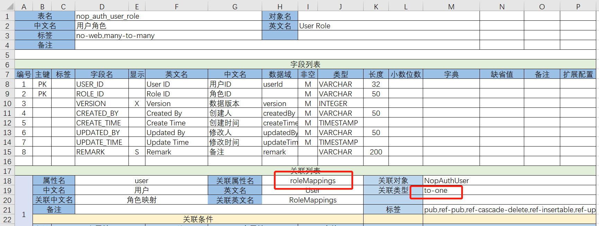

# 多对一或者一对一关联

在Excel数据模型中只需要配置子表到父表的外键关联:
to-one关联。如果需要在父表实体上增加集合属性，则只需要设置to-one关联上的关联属性名(relatedPropName)即可。



例如，在nop_auth_user_role表中的user_id字段关联了nop_auth_user表。只需要在nop_auth_user_role的配置中增加to-one关联属性，属性名user，
关联的实体对象是NopAuthUser。因为设置了关联属性名roleMappings，代码生成时NopAuthUser对象上会增加一个Set<NopAuthUserRole>
类型的集合属性，
属性名为roleMappings。具体生成的实体类伪代码如下:

````java
class NopAuthUserRole {
    String userId;
    NopAuthUser user;

    // ...
}

class NopAuthUser {
    //...
    Set<NopAuthUserRole> roleMappings;
}
````

## 支持关联查询

定义了关联属性之后后台代码就可以直接使用关联查询了。但是为了暴露GraphQL服务还需要在meta文件中进行配置

> 要求在meta中配置主要是从安全性考虑，避免暴露太多的功能给前端，出现安全漏洞。比如前端不断发起对关联的大表的各种复杂查询请求。

具体参见[NopAuthOpLog.xmeta](https://gitee.com/canonical-entropy/nop-entropy/blob/master/nop-auth/nop-auth-service/src/main/resources/_vfs/nop/auth/model/NopAuthOpLog/NopAuthOpLog.xmeta)
中的配置

````xml

<meta>
    <props>
        <prop name="session.loginAddr" displayName="登录地址" queryable="true" sortable="true">
        </prop>
    </props>
</meta>
````

queryable表示该字段可查询，sortable表示该字段可排序。此外还可以设置insertable,updatable等属性。

在前端的XView模型中就可以使用session.loginAddr这样的字段了。

````xml

<grid>
    <cols>
        <col id="sessionId"/>
        <col id="session.loginAddr" sortable="true"/>
    </cols>
</grid>
````

meta中prop的sortable是后台服务是否支持排序，而grid的prop上的sortable则是在前台是否允许排序

sessionId是列表中已有的字段。session.loginAddr是新增的关联字段，它被插入到sessionId字段的后面。

>
Nop平台的Delta合并策略会尽量保持原有节点顺序，具体规则参见 [x-override.md](https://gitee.com/canonical-entropy/nop-entropy/blob/master/docs/dev-guide/xlang/x-override.md)
