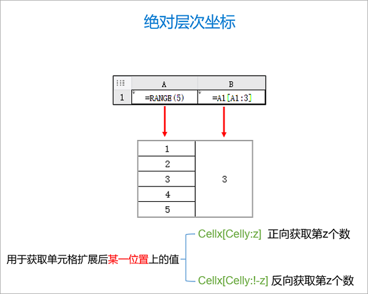

# 报表引擎

## 初始化数据

在Excel报表文件中，通过XptWorkbookModel这个Sheet来设置整个报表的初始化逻辑。它对应workbook.xdef元模型中的XptWorkbookModel定义。

一般我们在【展开前】这个xpl段中执行初始化代码，例如

```
<c:script>
  let entity = {...}
  assign("entity",entity);

  let ds1 = [...];
  xptRt.makeDs("ds1",ds1);
</c:script>
```

assign调用将把变量设置到scope上下文中，在报表单元格中就可以使用该变量。否则变量的作用域就是script内部，不会暴露给外部环境。
xptRt.makeDs函数将一个列表数据包装为ReportDataSet对象，并设置到scope上下文中。

## 单元格表达式

在单元格中，可以通过EL表达式形式来设置单元格的值，例如 ${entity.name}。

在单元格表达式的执行环境中存在一个全局变量 xptRt，它对应于IXptRuntime类型，提供如下属性和方法

- xptRt.cell : 当前单元格， ExpandedCell类型
- xptRt.row  : 当前行
- xptRt.table: 当前表格
- xptRt.sheet； 当前Excel表单
- xptRt.workbook: 当前Excel工作簿
- xptRt.field(name): 从最近邻的环境对象上获取字段值
- cell: 等价于xptRt.cell
- row: 等价于xptRt.row
- table: 等价于xptRt.table
- sheet: 等价于xptRt.sheet
- workbook: 等价于xptRt.workbook

### cell对象上的属性

* rowParent或者rp: 行父格
* colParent或者cp: 列父格
* expandValue 或者ev: 单元格展开表达式返回的条目值
* expandIndex 或者ei: 单元格展开时在父格中的下标，从0开始

## 单元格展开

在单元格的批注中可以写如下属性

- expandType:  r表示沿行的方向展开，而c表示沿列的方向展开
- expandExpr:  如果非空，则表达式应该返回一个集合，当前单元格会按照此集合的值展开成多个单元格。
- ds: 当前数据源对象
- field: 如果没有指定expandExpr，而指定了field，则按照该字段对当前数据集进行汇总，然后针对分组情况进行展开。
- keepExpandEmpty: 当展开集合返回空时，缺省情况下会把对应单元格及其子单元格都删除。但是如果设置了keepExpandEmpty，则这些未展开的单元格会保留，但值会被设置为null
- rowParent: 行父格。必须是一个设置了expandType的单元格。行父格展开时会复制所有的子单元格。如果不指定，则向左侧查找。
- colParent: 列父格。必须是一个设置了expandType的单元格。列父格展开时会复制所有的子单元格。如果不指定，则向上查找。

在单元格的文本中，我们可以直接写表达式语法。优点是在界面上可以直接看见表达式内容，而不需要把批注展开。
支持两种格式的文本表达式语法：

1. EL表达式：例如${entity.myField}
2. 展开表达式：它采用 `*=`作为前缀
   A. `*=fieldName` 等价于配置field=fieldName
   B. `*=^ds1!fieldName`，等价于配置 expandType=r, ds=ds1, field=fieldName
   C. `*=>ds1!fieldName` 等价于配置 expandType=c, ds=ds1, field=fieldName

## 层次坐标

层次坐标是由润乾报表所首创的一种报表数据定位方式。目前Nop平台的实现类似于帆软报表的设计：[层次坐标](https://help.fanruan.com/finereport/doc-view-3802.html)

层次坐标分为相对坐标和绝对坐标：





## 常用公式

1. 在C3(占比)单元格中直接使用占比公式：=PROPORTION(B3)；占比：当前值占总值的比例

2. 比较：当前值与第一个值做比较 计算公式为：当前值减去第一个值（C2/C2[A2:1]）

3. 环比：当前值比上月份的值； 计算公式 IF(B4.expandIndex > 0 , C4 / C4[B4:-1] , '--') , B4为月份，C4为金额

4. 单元格展开位置： A2.expandIndex 从0开始，对应于帆软表达式的 &A2

5. 同期比：

## 内置函数

具体参见[ReportFunctions](https://gitee.com/canonical-entropy/nop-entropy/blob/master/nop-report/nop-report-core/src/main/java/io/nop/report/core/functions/ReportFunctions.java)
类中定义的函数。

* SUM
* PRODUCT
* COUNT
* COUNTA
* AVERAGE
* MIN
* MAX
* NVL(value, defaultValue): 当value为null时返回defaultValue
* PROPORTIION: 占比
* RANK: 计算排名
* ACCSUM: 累积汇总

## 导出Excel公式
如果单元格配置设置了exportFormula=true，或者在Excel单元格中配置了Excel公式，则导出Excel的时候会将valueExpr转换为Excel公式输出。例如 SUM(A3)将可以经过报表展开后成为 SUM(A3:D5)

## 与润乾集算器集成

润乾软件开源了一个数据处理中间件，可以使用类似于报表表达式的机制对异构数据进行处理加工。在Nop平台中可以很方便的集成SPL处理引擎。具体参见[spl.md](spl.md)

## 常用表达式

* xptRt.incAndGet(seqName): 相当于是 seqName ++，即读取seqName对应的变量值，执行递增操作，然后返回递增之前的值。如果一开始变量不存在，则认为初始化为0